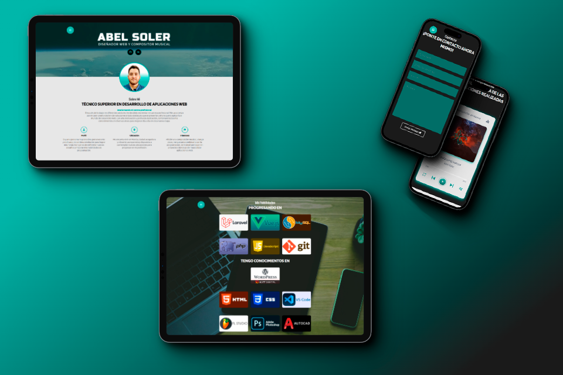

# 🎵🖥️ Abel Soler - Portfolio Website

## 👇 Table of contents

- [🕹️ Project Description](#-project-description)
- [💻 Technologies](#-technologies)
- [📞 Contact](#-contact)

## 🕹️ Project Description

This is my personal website where I showcase my skills in web development and music composition. Some of the features of this website include:

• A responsive design using HTML5, CSS and JavaScript
• A sidebar menu with a toggle function using mostrarOcultarMenu()
• A console typing animation effect using mostrarTextoEnConsola()
• Customized logos animation using document.addEventListener()
• A fully customized music player with play, stop, forward, shuffle and repeat buttons, and a list of my composed songs
• A contact section where visitors can fill out a form to send me a message directly to my email

## 💻 Technologies

This website has been developed using HTML5, CSS and JavaScript. The music player and animations were implemented using JavaScript.

## 📞 Contact

If you have some doubts or need to ask something about the project, feel free to reach me here:

- GitHub: [https://github.com/AbelSolerDev](https://github.com/AbelSolerDev)
- LinkedIn: [https://www.linkedin.com/in/abel-soler-8ba374a0/](https://www.linkedin.com/in/abel-soler-8ba374a0/)
- Website: [https://www.abelsoler.es](https://www.abelsoler.es)
